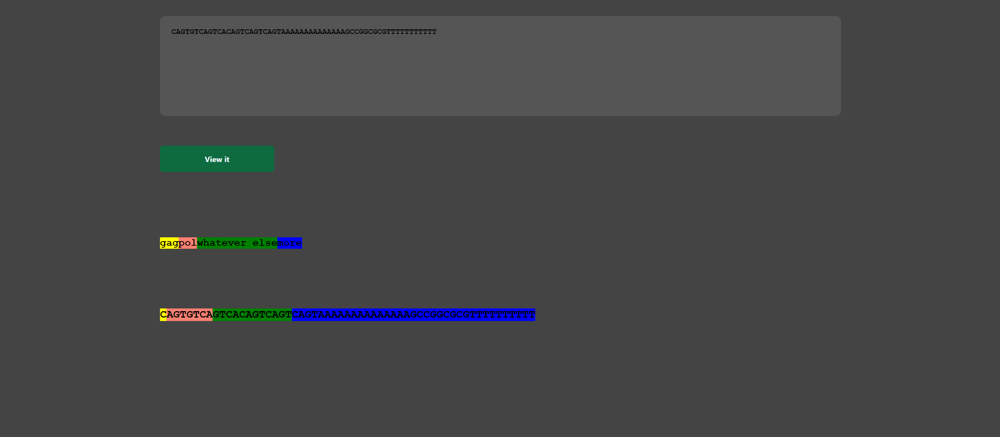

# shortSeqAnnotator
shortSeqAnnotator is a simple way of annotating a sequence along it's length. Useful for annotating polyproteins for a visual representation of your sequence.

The program will attempt to find a conserved sequence (which you define), and orient the annotation around that (based on the coordinates that you give it).

For example, I could give it the starting coordinates of gag and pol, and a conserved sequence that I expect to be in any HIV sequence. Then I can paste my sequence into the textbox and visualize it.

Visualization changes the background color of the font, but you can change that to represent it in any way you like, and change the number of annotations that are made.

The entire script runs in your browser and doesn't save any information.

  

